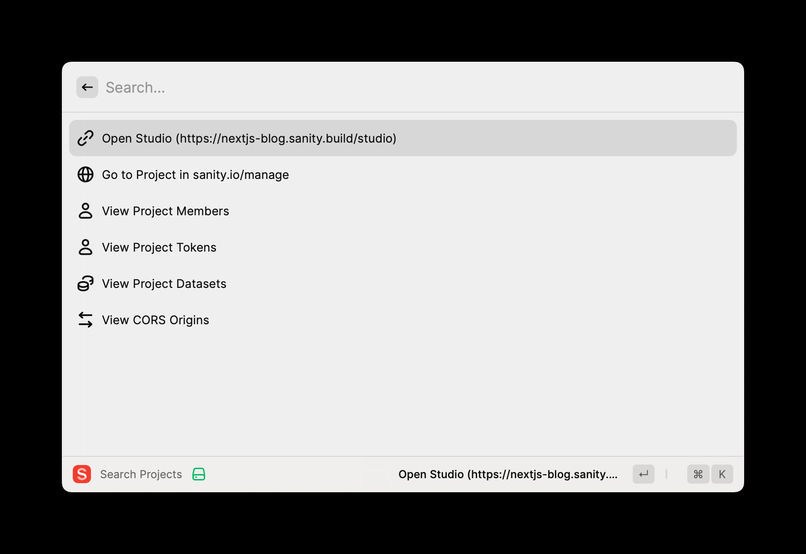

# Raycast extension for Sanity

Quickly search and interact with your Sanity projects.

## Setup

This extension leverages the same authentication as your Sanity CLI. To log in on your computer, run the following in your command line interface (requires you to have [Node.js installed](https://nodejs.org/en)):

```sh
npx sanity login
```

## Features:

- List all projects you have access to:
  - Copy Project ID
  - Open Sanity Studio
  - Open project on sanity.io/manage
  - List all members
  - List tokens
  - List datasets and copy dataset name
  - List CORS origins
  - Add new CORS origin

## Roadmap

- Ability to filter projects by organization
- Create and edit projects
- Manage datasets
- Anything else you can do with the [Projects API](https://www.sanity.io/docs/projects-api)

Contributions are welcome!

## Screenshots


